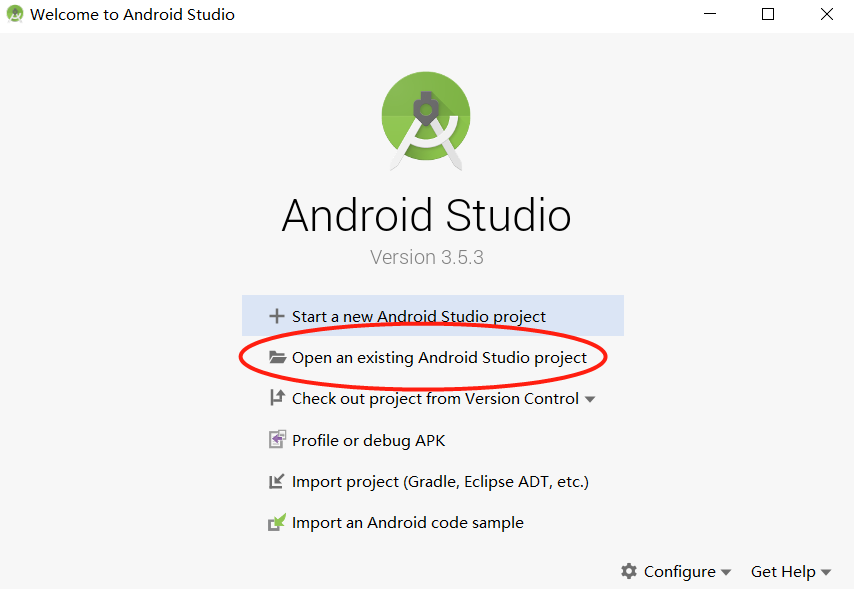
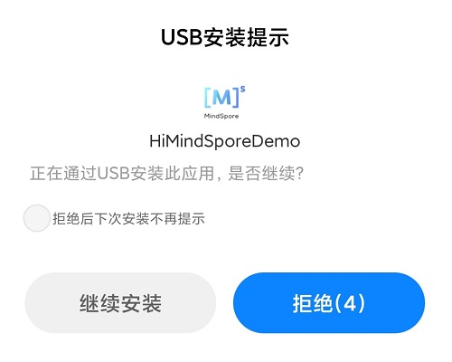
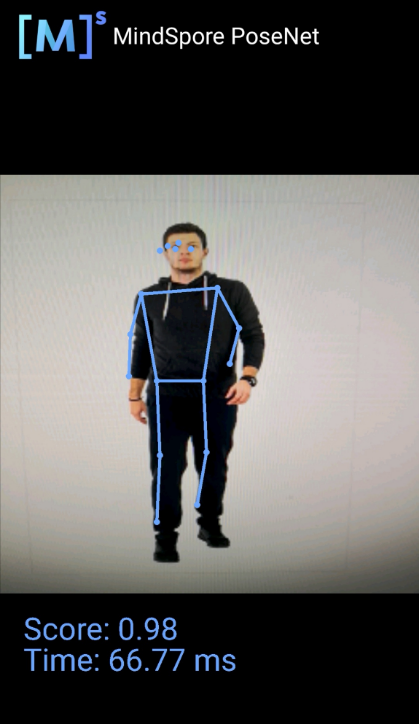

# MindSpore Lite 端侧骨骼检测demo（Android）

本示例程序演示了如何在端侧利用MindSpore Lite API以及MindSpore Lite骨骼检测模型完成端侧推理，对设备摄像头捕获的内容进行检测，并在App图像预览界面中显示连续目标检测结果。

## 运行依赖

- Android Studio >= 3.2 (推荐4.0以上版本)
- NDK 21.3
- CMake 3.10
- Android SDK >= 26

## 构建与运行

1. 在Android Studio中加载本示例源码，并安装相应的SDK（指定SDK版本后，由Android Studio自动安装）。

    

    启动Android Studio后，点击`File->Settings->System Settings->Android SDK`，勾选相应的SDK。如下图所示，勾选后，点击`OK`，Android Studio即可自动安装SDK。

    

    使用过程中若出现Android Studio配置问题，可参考第4项解决。

2. 连接Android设备，运行骨骼检测示例应用程序。

    通过USB连接Android设备调试，点击`Run 'app'`即可在你的设备上运行本示例项目。
    > 编译过程中Android Studio会自动下载MindSpore Lite、模型文件等相关依赖项，编译过程需做耐心等待。

    

    Android Studio连接设备调试操作，可参考<https://developer.android.com/studio/run/device?hl=zh-cn>。

3. 在Android设备上，点击“继续安装”，安装完即可查看到设备摄像头捕获的内容和推理结果。

    

    使用骨骼检测模型的输出如图：

    蓝色标识点检测人体面部的五官分布及上肢、下肢的骨骼走势。此次推理置信分数0.98/1，推理时延66.77ms。

    

4. Android Studio 配置问题解决方案可参考下表：

    |      | 报错                                                         | 解决方案                                                     |
    | ---- | ------------------------------------------------------------ | ------------------------------------------------------------ |
    | 1    | Gradle sync failed: NDK not configured.                      | 在local.properties中指定安装的ndk目录：ndk.dir={ndk的安装目录} |
    | 2    | Requested NDK version did not match the version requested by ndk.dir | 可手动下载相应的[NDK版本](https://developer.android.com/ndk/downloads?hl=zh-cn)，并在Project Structure - Android NDK location设置中指定SDK的位置（可参考下图完成） |
    | 3    | This version of Android Studio cannot open this project, please retry with Android Studio or newer. | 在工具栏-help-Checkout for Updates中更新版本                 |
    | 4    | SSL peer shut down incorrectly                               | 重新构建                                                     |

    

## 示例程序详细说明  

骨骼检测Android示例程序通过Android Camera 2 API实现摄像头获取图像帧，以及相应的图像处理等功能，在[Runtime](https://www.mindspore.cn/tutorial/lite/zh-CN/master/use/runtime.html)中完成模型推理的过程。

### 示例程序结构

```text

├── app
│   ├── build.gradle # 其他Android配置文件
│   ├── download.gradle # APP构建时由gradle自动从HuaWei Server下载依赖的库文件及模型文件
│   ├── proguard-rules.pro
│   └── src
│       ├── main
│       │   ├── AndroidManifest.xml # Android配置文件
│       │   ├── java # java层应用代码
│       │   │   └── com
│       │   │       └── mindspore
│       │   │           └── posenetdemo # 图像处理及推理流程实现
│       │   │               ├── CameraDataDealListener.java
│       │   │               ├── ImageUtils.java
│       │   │               ├── MainActivity.java
│       │   │               ├── PoseNetFragment.java
│       │   │               ├── Posenet.java #
│       │   │               └── TestActivity.java
│       │   └── res # 存放Android相关的资源文件
│       └── test
└── ...

```

### 下载及部署模型文件

从MindSpore Model Hub中下载模型文件，本示例程序中使用的目标检测模型文件为`posenet_model.ms`，同样通过`download.gradle`脚本在APP构建时自动下载，并放置在`app/src/main/assets`工程目录下。

> 若下载失败请手动下载模型文件，posenet_model.ms [下载链接](https://download.mindspore.cn/model_zoo/official/lite/posenet_lite/posenet_model.ms)。

### 编写端侧推理代码

在骨骼检测demo中，使用Java API实现端测推理。相比于C++ API，Java API可以直接在Java Class中调用，无需实现JNI层的相关代码，具有更好的便捷性。

- 本实例通过识别鼻子眼睛等身体特征、获取身体特征位置、计算结果的置信分数，来实现骨骼检测的目的。

  ```java
  public enum BodyPart {
      NOSE,
      LEFT_EYE,
      RIGHT_EYE,
      LEFT_EAR,
      RIGHT_EAR,
      LEFT_SHOULDER,
      RIGHT_SHOULDER,
      LEFT_ELBOW,
      RIGHT_ELBOW,
      LEFT_WRIST,
      RIGHT_WRIST,
      LEFT_HIP,
      RIGHT_HIP,
      LEFT_KNEE,
      RIGHT_KNEE,
      LEFT_ANKLE,
      RIGHT_ANKLE
  }

  public class Position {
      int x;
      int y;
  }

  public class KeyPoint {
      BodyPart bodyPart = BodyPart.NOSE;
      Position position = new Position();
      float score = 0.0f;
  }

  public class Person {
      List<KeyPoint> keyPoints;
      float score = 0.0f;
  }
  ```

骨骼检测demo推理代码流程如下，完整代码请参见：`src/main/java/com/mindspore/posenetdemo/Posenet.java`。

1. 加载MindSpore Lite模型文件，构建上下文、会话以及用于推理的计算图。

    - 加载模型：从文件系统中读取MindSpore Lite模型，并进行模型解析。

        ```java
        // Load the .ms model.
        model = new Model();
        if (!model.loadModel(mContext, "posenet_model.ms")) {
            Log.e("MS_LITE", "Load Model failed");
            return false;
        }
        ```

    - 创建配置上下文：创建配置上下文`MSConfig`，保存会话所需的一些基本配置参数，用于指导图编译和图执行。

        ```java
        // Create and init config.
        msConfig = new MSConfig();
        if (!msConfig.init(DeviceType.DT_CPU, NUM_THREADS, CpuBindMode.MID_CPU)) {
            Log.e("MS_LITE", "Init context failed");
            return false;
        }
        ```

    - 创建会话：创建`LiteSession`，并调用`init`方法将上一步得到`MSConfig`配置到会话中。

        ```java
        // Create the MindSpore lite session.
        session = new LiteSession();
        if (!session.init(msConfig)) {
            Log.e("MS_LITE", "Create session failed");
            msConfig.free();
            return false;
        }
        msConfig.free();
        ```

    - 加载模型文件并构建用于推理的计算图

        ```java
        // Complile graph.
        if (!session.compileGraph(model)) {
            Log.e("MS_LITE", "Compile graph failed");
            model.freeBuffer();
            return false;
        }

        // Note: when use model.freeBuffer(), the model can not be complile graph again.
        model.freeBuffer();
        ```

2. 输入数据： Java目前支持`byte[]`或者`ByteBuffer`两种类型的数据，设置输入Tensor的数据。

   - 在输入数据之前，需要对存储图像信息的Bitmap进行解读分析与转换。

       ```java
        /**
         * Scale the image to a byteBuffer of [-1,1] values.
         */
        private ByteBuffer initInputArray(Bitmap bitmap) {
            final int bytesPerChannel = 4;
            final int inputChannels = 3;
            final int batchSize = 1;
            ByteBuffer inputBuffer = ByteBuffer.allocateDirect(
                    batchSize * bytesPerChannel * bitmap.getHeight() * bitmap.getWidth() * inputChannels
            );
            inputBuffer.order(ByteOrder.nativeOrder());
            inputBuffer.rewind();

            final float mean = 128.0f;
            final float std = 128.0f;
            int[] intValues = new int[bitmap.getWidth() * bitmap.getHeight()];
            bitmap.getPixels(intValues, 0, bitmap.getWidth(), 0, 0, bitmap.getWidth(), bitmap.getHeight());


            int pixel = 0;
            for (int y = 0; y < bitmap.getHeight(); y++) {
                for (int x = 0; x < bitmap.getWidth(); x++) {
                    int value = intValues[pixel++];
                    inputBuffer.putFloat(((float) (value >> 16 & 0xFF) - mean) / std);
                    inputBuffer.putFloat(((float) (value >> 8 & 0xFF) - mean) / std);
                    inputBuffer.putFloat(((float) (value & 0xFF) - mean) / std);
                }
            }
            return inputBuffer;
        }
        ```

   - 通过`ByteBuffer`输入数据。

       ```java
        long estimationStartTimeNanos = SystemClock.elapsedRealtimeNanos();
        ByteBuffer inputArray = this.initInputArray(bitmap);
        List<MSTensor> inputs = session.getInputs();
        if (inputs.size() != 1) {
            return null;
        }

        Log.i("posenet", String.format("Scaling to [-1,1] took %.2f ms",
                1.0f * (SystemClock.elapsedRealtimeNanos() - estimationStartTimeNanos) / 1_000_000));

        MSTensor inTensor = inputs.get(0);
        inTensor.setData(inputArray);
        long inferenceStartTimeNanos = SystemClock.elapsedRealtimeNanos();
       ```

3. 对输入Tensor按照模型进行推理，获取输出Tensor，并进行后处理。

   - 使用`runGraph`进行模型推理。

        ```java
        // Run graph to infer results.
        if (!session.runGraph()) {
            Log.e("MS_LITE", "Run graph failed");
            return null;
        }

        lastInferenceTimeNanos = SystemClock.elapsedRealtimeNanos() - inferenceStartTimeNanos;
        Log.i(
                "posenet",
                String.format("Interpreter took %.2f ms", 1.0f * lastInferenceTimeNanos / 1_000_000)
        );
       ```

   - 通过输出Tensor得到推理结果。

        ```java
        // Get output tensor values.
        List<MSTensor> heatmaps_list = session.getOutputsByNodeName("Conv2D-27");
        if (heatmaps_list == null) {
            return null;
        }
        MSTensor heatmaps_tensors = heatmaps_list.get(0);

        float[] heatmaps_results = heatmaps_tensors.getFloatData();
        int[] heatmapsShape = heatmaps_tensors.getShape(); //1, 9, 9 ,17

        float[][][][] heatmaps = new float[heatmapsShape[0]][][][];
        for (int x = 0; x < heatmapsShape[0]; x++) {  // heatmapsShape[0] =1
            float[][][] arrayThree = new float[heatmapsShape[1]][][];
            for (int y = 0; y < heatmapsShape[1]; y++) {  // heatmapsShape[1] = 9
                float[][] arrayTwo = new float[heatmapsShape[2]][];
                for (int z = 0; z < heatmapsShape[2]; z++) { //heatmapsShape[2] = 9
                    float[] arrayOne = new float[heatmapsShape[3]]; //heatmapsShape[3] = 17
                    for (int i = 0; i < heatmapsShape[3]; i++) {
                        int n = i + z * heatmapsShape[3] + y * heatmapsShape[2] * heatmapsShape[3] + x * heatmapsShape[1] * heatmapsShape[2] * heatmapsShape[3];
                        arrayOne[i] = heatmaps_results[n]; //1*9*9*17  ??
                    }
                    arrayTwo[z] = arrayOne;
                }
                arrayThree[y] = arrayTwo;
            }
            heatmaps[x] = arrayThree;
        }


        List<MSTensor> offsets_list = session.getOutputsByNodeName("Conv2D-28");
        if (offsets_list == null) {
            return null;
        }
        MSTensor offsets_tensors = offsets_list.get(0);
        float[] offsets_results = offsets_tensors.getFloatData();
        int[] offsetsShapes = offsets_tensors.getShape();

        float[][][][] offsets = new float[offsetsShapes[0]][][][];
        for (int x = 0; x < offsetsShapes[0]; x++) {
            float[][][] offsets_arrayThree = new float[offsetsShapes[1]][][];
            for (int y = 0; y < offsetsShapes[1]; y++) {
                float[][] offsets_arrayTwo = new float[offsetsShapes[2]][];
                for (int z = 0; z < offsetsShapes[2]; z++) {
                    float[] offsets_arrayOne = new float[offsetsShapes[3]];
                    for (int i = 0; i < offsetsShapes[3]; i++) {
                        int n = i + z * offsetsShapes[3] + y * offsetsShapes[2] * offsetsShapes[3] + x * offsetsShapes[1] * offsetsShapes[2] * offsetsShapes[3];
                        offsets_arrayOne[i] = offsets_results[n];
                    }
                    offsets_arrayTwo[z] = offsets_arrayOne;
                }
                offsets_arrayThree[y] = offsets_arrayTwo;
            }
            offsets[x] = offsets_arrayThree;
        }
        ```

   - 对输出节点的数据进行处理，得到骨骼检测demo的返回值`person`，实现功能。

        `Conv2D-27`中，`heatmaps`存储`height`、`weight`、`numKeypoints`三种参数，可用于求出`keypointPosition`位置信息。

        `Conv2D-28`中，`offset`代表位置坐标的偏移量，与`keypointPosition`结合可获取`confidenceScores`置信分数，用于判断模型推理结果。

        通过`keypointPosition`与`confidenceScores`，获取`person.keyPoints`和`person.score`，得到模型的返回值`person`。

        ```java
        int height = ((Object[]) heatmaps[0]).length;  //9
        int width = ((Object[]) heatmaps[0][0]).length; //9
        int numKeypoints = heatmaps[0][0][0].length; //17

        // Finds the (row, col) locations of where the keypoints are most likely to be.
        Pair[] keypointPositions = new Pair[numKeypoints];
        for (int i = 0; i < numKeypoints; i++) {
            keypointPositions[i] = new Pair(0, 0);
        }

        for (int keypoint = 0; keypoint < numKeypoints; keypoint++) {
            float maxVal = heatmaps[0][0][0][keypoint];
            int maxRow = 0;
            int maxCol = 0;
            for (int row = 0; row < height; row++) {
                for (int col = 0; col < width; col++) {
                    if (heatmaps[0][row][col][keypoint] > maxVal) {
                        maxVal = heatmaps[0][row][col][keypoint];
                        maxRow = row;
                        maxCol = col;
                    }
                }
            }
            keypointPositions[keypoint] = new Pair(maxRow, maxCol);
        }

        // Calculating the x and y coordinates of the keypoints with offset adjustment.
        int[] xCoords = new int[numKeypoints];
        int[] yCoords = new int[numKeypoints];
        float[] confidenceScores = new float[numKeypoints];
        for (int i = 0; i < keypointPositions.length; i++) {
            Pair position = keypointPositions[i];
            int positionY = (int) position.first;
            int positionX = (int) position.second;

            yCoords[i] = (int) ((float) positionY / (float) (height - 1) * bitmap.getHeight() + offsets[0][positionY][positionX][i]);
            xCoords[i] = (int) ((float) positionX / (float) (width - 1) * bitmap.getWidth() + offsets[0][positionY][positionX][i + numKeypoints]);
            confidenceScores[i] = sigmoid(heatmaps[0][positionY][positionX][i]);
        }

        Person person = new Person();
        KeyPoint[] keypointList = new KeyPoint[numKeypoints];
        for (int i = 0; i < numKeypoints; i++) {
            keypointList[i] = new KeyPoint();
        }

        float totalScore = 0.0f;
        for (int i = 0; i < keypointList.length; i++) {
            keypointList[i].position.x = xCoords[i];
            keypointList[i].position.y = yCoords[i];
            keypointList[i].score = confidenceScores[i];
            totalScore += confidenceScores[i];
        }
        person.keyPoints = Arrays.asList(keypointList);
        person.score = totalScore / numKeypoints;

        return person;
        ```
